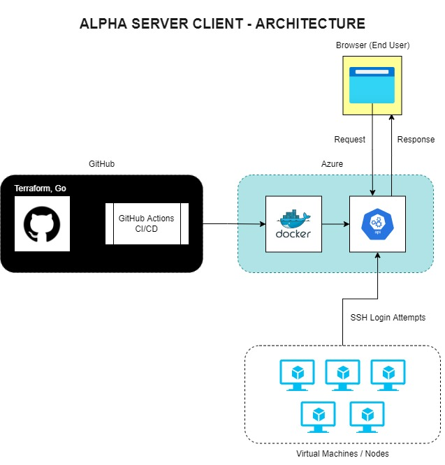
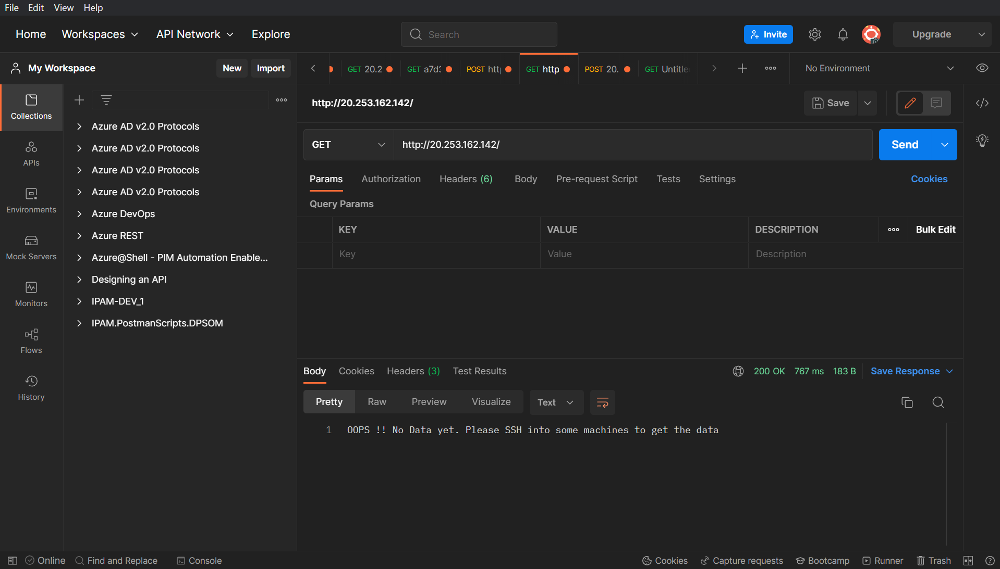
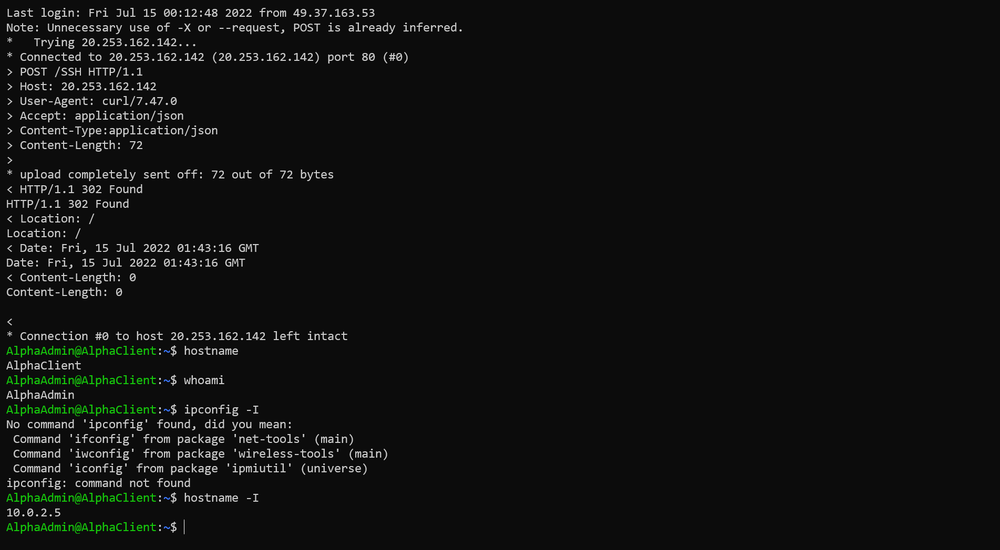
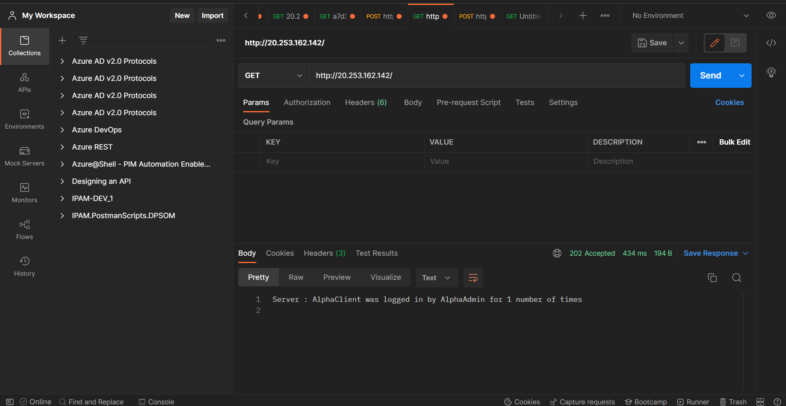

# Introduction

Alpha Client Server is a very small use-case project that logs the SSH attempts from various nodes in a centralized repository. The use case is very simple and it mainly focuses on key areas like as follows.

- Cloud Agnostic
- Scalability
- Reliability
- Idempotence

## Components of the solution

This project mainly deals with two components as follows.

1. Server - Logs the SSH login attempts from the reporting nodes.
2. Client - Sends the SSH login attempts to the central server.

## Technical Stack

This project involves various key components in the tech stack and if we unload the stack, we'll get the following.

- **_Go lang_**: A simple web-server written with the help of Gin framework that acts as our backend.
- **_Docker_**: A open-source containerization runtime that we use to build our packages along with its dependencies.
- **_Kubernetes or K8s_**: Kubernetes is the open-source container orchestration platform developed by Google. It helps us to scale based on the traffic.
- **_GitHub Actions:_** GitHub Actions is the CI/CD pipeline that we use to deploy our code in an automated manner.
- **_Terraform:_** Terraform is yet another open-source **Infrastructure as a Code (IaC)** software tool created by Hashicorp that helps us to deploy idempotent resources in a declarative fashion. It helps us to achieve idempotence for the servers and multiple runs won't affect the resources.
- **_Azure_**: Last but not the least, Azure is our cloud provider where we'll be deploying and hosting our entire infrastructure.

## Architecture

The High Level Design and the Architecture are shown as a diagram here.



## Working

### How does the Alpha Client work?

The whole automation works with the help of .bashrc file that is located for every user.
Whenever a user logins interactively through the SSH, the ".bashrc" file will be called as a first step. Hence, this automation is embedded into that file and will be called during every SSH Login.

```bash
curl http://20.253.162.142/SSH \
    -v -i -L\
    -X POST \
    -H "Accept: application/json" \
    -H "Content-Type:application/json" \
    -d "$body"
```

### How does the Alpha Server work?

The main server is nothing but a simple REST Api developed using Go GIN framework. This API will capture the metrics sent to it from various nodes and displays it in the "homepage".

The below page shows the empty records before any SSH login has happened.



Now, we'll try to login and we'll check back the server again.



Finally, we'll try to go to the source server to check the metrics.



## Triggers

### How to Trigger the CI/CD deployment?

Due to the simplicity of this project, it is been configured with _continuos deployment_ instead of _continuos delivery_. Whenever you push any code to the main branch or if any pull requests are created, then the pipeline will be triggered.

### How to configure the Alpha Client?

Alpha Server is a REST API and can be triggered either via tool like Postman or the browser. The Virtual Machines or nodes won't have these capabilities and so, we have to achieve it via scripting.

---
Alpha Client.sh

```bash

#!/bin/sh

servername=$(hostname)
ipaddress=$(hostname -I)
useradmin=$(whoami)

body=$(cat <<EOF
{
"user": "$useradmin",
"servername": "$servername",
"ip": "$ipaddress"
}
EOF
)


curl http://20.253.162.142/SSH \
    -v -i -L\
    -X POST \
    -H "Accept: application/json" \
    -H "Content-Type:application/json" \
    -d "$body"
```

- Copy the above mentioned script and save it as "alphaclient.sh" in any user directory.
- Open the bashrc file with the help of the below command as a sudo user.

```bash
sudo vi ~\.bashrc 
```

- Once the editor is opened, add the above script as source so that it will be called durinig every SSH attempt.

```bash
source /path/to/alphaclient.sh
```

## Conclusion

### My take on this

> Being a Site Reliability Engineer for almost three years, I couldn't get an opportunity to work on containerization and container orchestration. As a part of this exercise, I really learnt a lot and enjoyed the whole process. Kubernetes and Docker are very powerful tools and helps in establishing the true flavour of "DevOps" operating model with frequent deployments and zero downtime.
